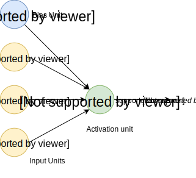
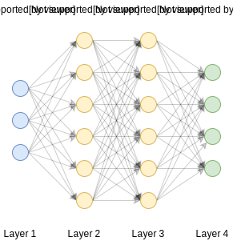

# Neural Network

**Artificial neural networks** (ANN) or connectionist systems are computing systems vaguely inspired by the biological neural networks that constitute animal brains. The neural network itself isn't an algorithm, but rather a framework for many different machine learning algorithms to work together and process complex data inputs. Such systems "learn" to perform tasks by considering examples, generally without being programmed with any task-specific rules.

For example, in **image recognition**, they might learn to identify images that contain cats by analyzing example images that have been manually labeled as "cat" or "no cat" and using the results to identify cats in other images. They do this without any prior knowledge about cats, e.g., that they have fur, tails, whiskers and cat-like faces. Instead, they automatically generate identifying characteristics from the learning material that they process.

An ANN is based on a collection of connected units or nodes called **artificial neurons**, which loosely model the neurons in a biological brain. Each connection, like the synapses in a biological brain, can transmit a signal from one artificial neuron to another. An artificial neuron that receives a signal can process it and then signal additional artificial neurons connected to it.

In common ANN implementations, the signal at a connection between artificial neurons is a real number, and the output of each artificial neuron is computed by some non-linear function of the sum of its inputs. The connections between artificial neurons are called **edges**. Artificial neurons and edges typically have a **weight** that adjusts as learning proceeds. The weight increases or decreases the strength of the signal at a connection. Artificial neurons may have a threshold such that the signal is only sent if the aggregate signal crosses that threshold. Typically, artificial neurons are aggregated into layers. Different layers may perform different kinds of transformations on their inputs. Signals travel from the first layer (the **input layer**), to the last layer (the **output layer**), possibly after traversing the **inner layers** multiple times.

## Neuron Model: Logistic Unit

Weights:

## Forward Propagation

Forward propagation is an interactive process of calculating activations for each layer starting from the input layer and going to the output layer.

Let's take a look at simple example model with one hidden layer.

 - "activation" of unit _i_ in layer _j_.

 - matrix of weights controlling function mapping from layer _j_ to layer _j + 1_. For example for the first layer: .

Then we're able to calculations activations for second layer based on the input layer and our network parameters:

The output layer activation will be calculated based on the hidden layer activations:

Where _g()_ function may be a sigmoid:

### Vectorized Implementation of Forward Propagation

Now let's convert previous calculations into more concise vectorized form.

To simplify previous activation equations let's introduce a _z_ variable:

> Don't forget to add bias units (activations) before propagating to the next layer.
> 

## Multi-class Classification

In order to make neural network to work with multi-class notification we may use **One-vs-All** approach.

Let's say we want our network to distinguish if there is a _pedestrian_ or _car_ of _motorcycle_ or _truck_ is on the image.

In this case the output layer of our network will have 4 units (input layer will be much bigger and it will have all the pixel from the image. Let's say if all our images will be 20x20 pixels then the input layer will have 400 units each of which will contain the black-white color of the corresponding picture).

In this case we would expect our final hypothesis to have following values:

In this case for the training set:

We would have:

## Cost Function

## Backpropagation Algorithm

## Gradient Checking

## Random Initialization

## Training a Neural Network

## References

- [Machine Learning on Coursera](https://www.coursera.org/learn/machine-learning)
- [But what is a Neural Network? By 3Blue1Brown](https://www.youtube.com/watch?v=aircAruvnKk)
- [Neural Network on Wikipedia](https://en.wikipedia.org/wiki/Artificial_neural_network)
- [TensorFlow Neural Network Playground](https://playground.tensorflow.org/)
- [Deep Learning by Carnegie Mellon University](https://insights.sei.cmu.edu/sei_blog/2018/02/deep-learning-going-deeper-toward-meaningful-patterns-in-complex-data.html)
